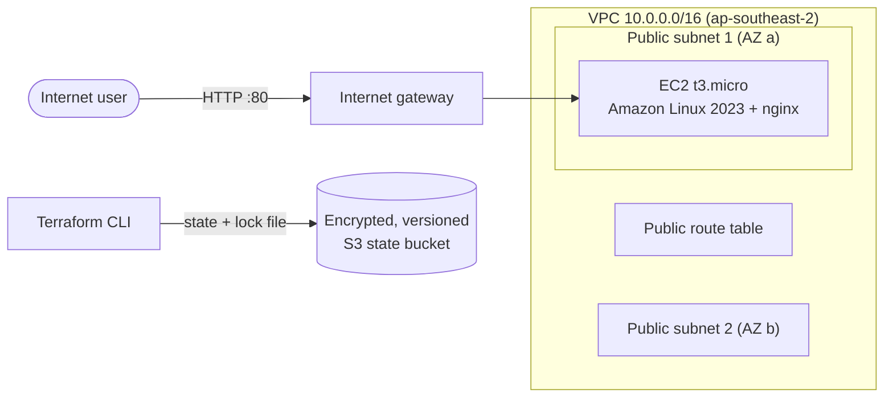

# AWS Web Infrastructure with Terraform

> A learning project from my Terraform journey. Built to practise modules, remote state and AWS networking; not intended for production use.

Provisions a complete, working web server environment on AWS entirely as code: a custom VPC spread across availability zones, an EC2 instance running nginx, a least-privilege security group, and remote state stored in an encrypted, versioned S3 bucket with state locking.

## Architecture



## What this project demonstrates

- **Reusable modules**: networking and compute are separate modules with their own inputs and outputs, composed in the root module.
- **Remote state**: S3 backend with encryption, versioning, public access blocked, and native S3 state locking (`use_lockfile`).
- **Bootstrapping**: the state bucket is itself created with Terraform, protected by `prevent_destroy`.
- **Dynamic configuration**: `count`, `for_each`, `cidrsubnet()`, `templatefile()`, splat expressions, and a data source that finds the latest Amazon Linux AMI instead of hard-coding an ID.
- **Input validation**: variables reject invalid environments, CIDR blocks, and subnet counts before anything reaches AWS.
- **Security practices**: IMDSv2 required, encrypted root volume, no SSH port open, ingress limited to HTTP from configurable CIDRs.
- **Consistent tagging**: `default_tags` on the provider tags every resource with Project, Environment, and ManagedBy.

## Project structure

```
.
├── bootstrap/                  # One-time setup: S3 bucket for remote state
│   └── main.tf
├── modules/
│   ├── network/                # VPC, public subnets, internet gateway, routing
│   └── web-server/             # Security group, EC2 instance, user data template
├── backend.tf                  # S3 remote state configuration
├── main.tf                     # Composes the modules
├── variables.tf                # Inputs with types, defaults, and validation
├── outputs.tf                  # Website URL and resource IDs
├── providers.tf                # AWS provider with default tags
├── versions.tf                 # Terraform and provider version constraints
└── terraform.tfvars.example    # Sample variable values
```

## Prerequisites

- Terraform 1.10 or newer
- AWS CLI configured with credentials for an IAM user that can manage EC2, VPC, and S3 resources

## Deployment

### 1. Create the state bucket (one time)

```bash
cd bootstrap
terraform init
terraform apply
```

Copy the `state_bucket_name` output.

### 2. Point the main project at the bucket

In `backend.tf`, ensure to mention the name of the bucket that we just created, which can be easily retrieved from the output console.

If the main project is destroyed with `terraform destroy`, and the bucket gets intentionally deleted, terraform apply must be run again in the /bootstrap folder and the `backend.tf` should refer the new bucket name seen in the console output.

### 3. Deploy

```bash
cd ..
cp terraform.tfvars.example terraform.tfvars   # optional: adjust values
terraform init
terraform plan
terraform apply
```

After about a minute for nginx to install, open the `website_url` output in a browser.

## Cost and cleanup

The networking resources are free. The EC2 instance and its public IPv4 address cost a few cents per hour, and the state bucket costs a fraction of a cent per month.

Tear everything down when finished:

```bash
terraform destroy          # main project
```

To also remove the state bucket, in `bootstrap/main.tf` delete the `lifecycle` block, add `force_destroy = true` to the bucket, then:

```bash
cd bootstrap
terraform apply
terraform destroy
```